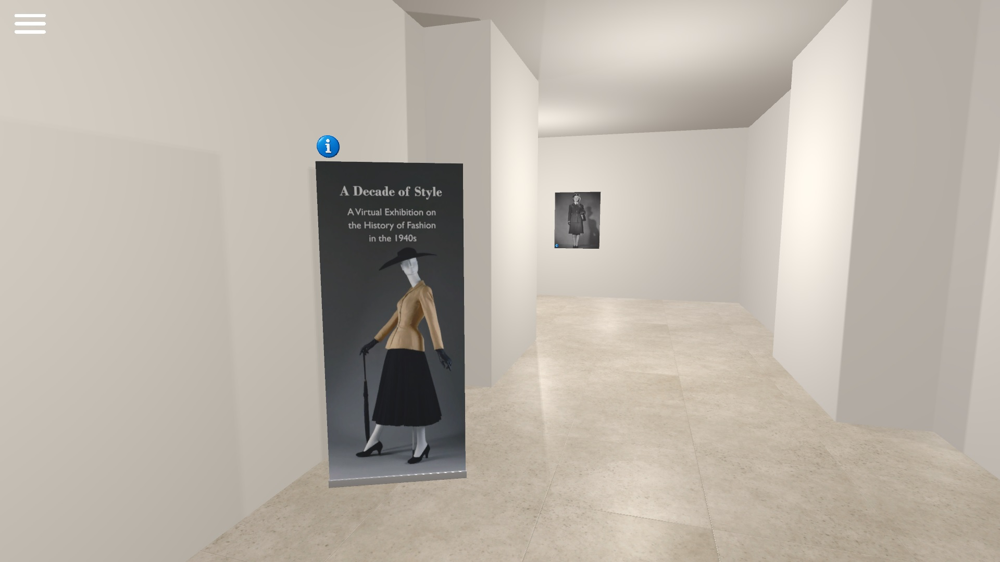
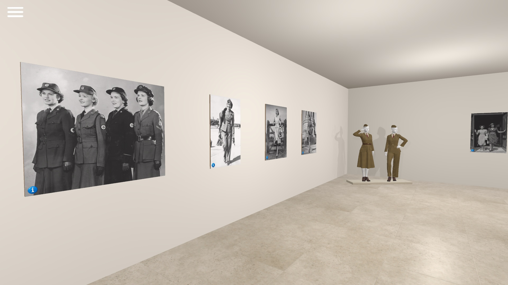
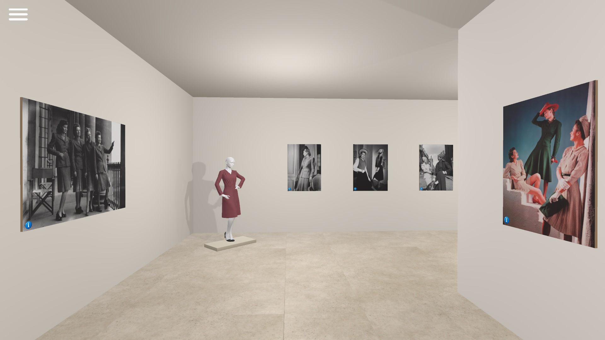
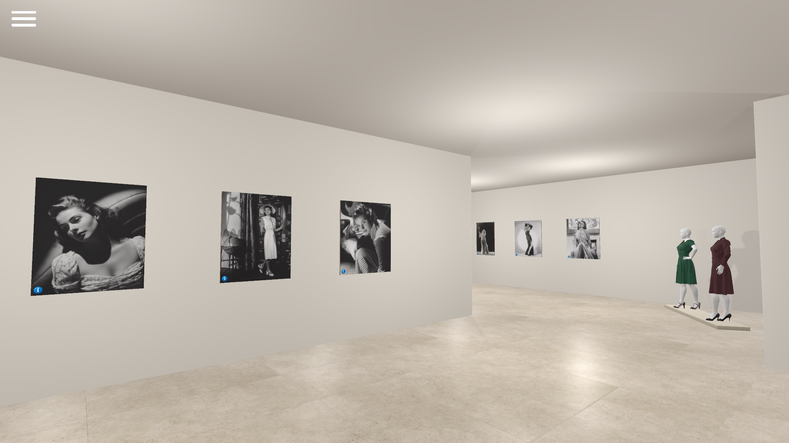
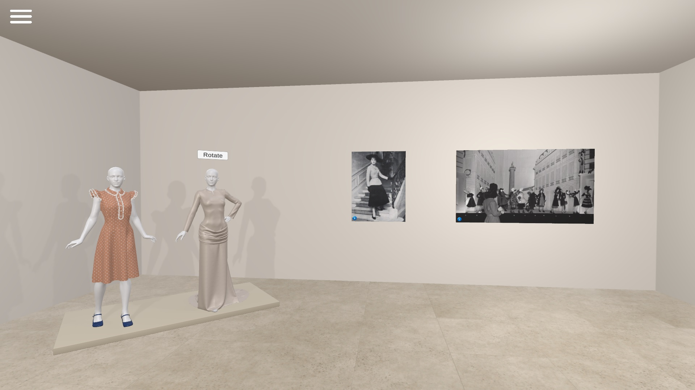

# A Decade of Style
### A Virtual Exhibition on the History of Fashion in the 1940s

An interactive virtual exhibition exploring fashion in the 1940s through digital garments, archival imagery, audiovisual content, and immersive storytelling.

---

## Project Overview

This project was developed for the course *Immersive Technologies for Fashion* at the University of Bologna.

The exhibition explores key aspects of 1940s fashion, including wartime clothing, everyday style, Hollywood influence, and the post-war transition. Designed as a guided sequence of thematic spaces, the project aims to present fashion history as an immersive experience rather than a static visual archive.

---

## Development Process

The project was created through a multi-software workflow:

- **Clo3D** — garment creation based on historical references
- **Daz Studio** — character models for garment presentation
- **Blender** — exhibition space modeling, layout, and environmental assets
- **Unity** — materials, lighting, interaction design, and final implementation

---

## Interactive Features

Visitors can interact with the exhibition through:

- Free navigation through the virtual space
- Clickable information panels on images and exhibits
- Historical captions and contextual fashion content
- Background music controls (play / pause / track selection / volume)
- Proximity-triggered video playback in the Hollywood section
- Interactive garment rotation for detailed viewing

---

## Screenshots

---

## How to Run

1. Download the latest release from the **Releases** section.
2. Extract the ZIP file.
3. Run the `.exe` file.
4. Navigate using keyboard and mouse.

---

## Credits

Historical references and archival imagery sourced from public collections and educational resources.

Additional assets:
- Vintage TV model — CGTrader

---

## Academic Publication

This project was published on the University of Bologna course project showcase.
